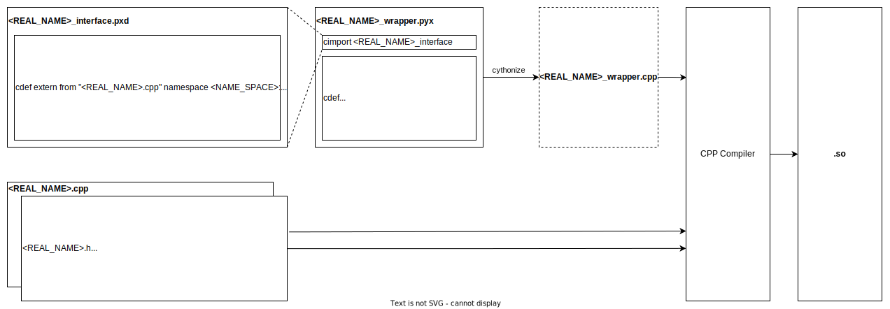

********************************
cython wrapping a c++ extentsion
********************************

The index of this document will include

A general archetecture of cython project

Should include as much as possible build information here

A example from example directory

A real world example from rble lib

.. warning::
  
  A numpy **float** is a C **double**!
  

Why
===

If you are thinking whether you need cython, in most case, you don't need it. Cython might be a good option if both conditions belwo satisfied.

  * You care more about running time instead of engineering time.
  * You have concluded that your engineering logic works in a slower language, optimization is next step.

What
====

1. Extension is python module you write in Other language, in here we refer C/C++
2. Cython will just use whatever standard C compiler to compile it to *.so* file
3. Eventually, python allow you import it

How: The architecture of a python project with cython extension
===============================================================

A conoventional architecture and naming rule is shown below:

.. code::

  <PROJECT>
    <MODULE>
      include
        <REAL_NAME>.h
      src
        <REAL_NAME>.cpp
      python
        <REAL_NAME>_wrapper.pyx
        <REAL_NAME>_interface.pxd
      tests
        .py
    setup.py

.. warning::

  Important! DO NOT name the *.pyx* file the same as your *.cpp* file! When the cythonize function is
  called later, a new *.cpp* file with the same name as your *.pyx* file is generated. If you name both
  your original *.cpp* and your *.pyx* file the same, your *.cpp* file will be overwritten! Which is bad.
  
  Though there is tldr `solution <https://cython.readthedocs.io/en/latest/src/userguide/external_C_code.html#resolving-naming-conflicts-c-name-specifications>`_ if you really need to name them exactly same.

A work flow shown below:

Stay with .h and .cpp
---------------------
The *.h* files in *include* and *.cpp* files in *src* are just pure/raw c++ files. They should be 100% legal in a pure c++ environment.

.pyx
----

`compute_wrapper.pyx <../../examples/cython/compute_wrapper.pyx>`_

.. literalinclude:: ../../examples/cython/compute_wrapper.pyx

Here we are basiclly write python code(Cython extension type) as a wrapper to wrap the logic of .cpp file. When I said wrapping C function,
I mean we define a python function and inside it, we just call our c function.

In my naive understanding, this file contain rewritten python-ish code that matches your function and class
in c++ files.

At the beginning, you need cimport your c class definition(It represent cpp class in a python/cython class way)
from pxd module. If you have 'compute_interface.pxd', then

.. code
  from <PXD_FILE_NAME> cimport <THING_DEFINED_BY_cdef>

In the python class that we are about to write, you need use cdef to define a python-ish class for latter use.

.. code:: python

	cdef class PyRectangle:
	    cdef Rectangle c_rect  # Hold a C++ instance which we're wrapping

which has a c object as an attribute

  * declare it by c class which was cimport just above. This declaration usually take place in class attribute
    location.
  
  .. code
      cdef Rectangle c_rect
  
  * In __cinit__ magic method, construct c object as a attribute of python class.
  
  .. code::
  
    def __cinit__(self, int x0, int y0, int x1, int y1):
      self.c_rect = Rectangle(x0, y0, x1, y1)

Next, you just need to rewrite all method you need by calling c object methods, like
  
  .. code::
  
    def get_area(self):
      return self.c_rect.getArea()
      
.pxd file
---------
* Here we are basiclly write Cython code(Cython extension type) as a wrapper to wrap the logic of .h file.
* The role of .pxd file is like a shared header file of cython code for convinent of writing .pyx file.

Use c++ file as source

Declare python/cython class with cdef 

.. code
  cdef extern from "Rectangle.h" namespace "shapes":
    cdef cppclass Rectangle:

Next we declare each method and private members

.. code::

  Rectangle() except +
  Rectangle(int, int, int, int) except +
  int x0, y0, x1, y1
  int getArea()
  void getSize(int* width, int* height)
  void move(int, int)
  
expcept + here is make sure that python will raise the exception of c++ error

Install package
===============

setup.py
--------
make sure code below are in setup.py

.. literalinclude:: ../../examples/cython/setup.py

Here the meaning of argument

* *name*: A architecture name that seperated by '.'(dot), dot is not meaning of file type
* sources: A list of source file that not being *cdef* in *.pxd* file

A minimal command run is below

.. code:: bash
  
  $ python setup.py build_ext

However if you need run the so in current file, you need add *--inplace* flag and if you wanna force to recompile each time, you need *--force*

.. code:: bash

	$ python setup.py build_ext --inplace --force
	

Use setup.cfg to make things easy
---------------------------------

There are tons of flag, so to make it easy, you could write all options and flag in a *setup.cfg*.

You could config *setup.cfg* by instruction here
https://docs.python.org/3/distutils/configfile.html

For example, configure by *setup.cfg* in a format like

.. code::

	[command]
	option=value
	...

the running code above could be configured

.. code::
  
  [build_ext]
  inplace=1
	force=1
  
and you could just run and the flags will add to the end automatically

.. code:: bash
  
  $ python setup.py build_ext

Practice with C and Python community: Eigne and Numpy
=====================================================

How to get Eigen library
------------------------

How to get numpy package
------------------------

How to get cpp std libray
-------------------------
https://cython.readthedocs.io/en/latest/src/userguide/wrapping_CPlusPlus.html?highlight=Rectangle#standard-library

A code here also work as good examples on how to declare C++ classes.

The code below perfectly show us the logistic to mix Eigen and Numpy with Cython. It trys call a *CalcPointAcceleration* from python which transfers all variables to cpp and use some cpp source code with Eigen do real math calculation and then transfer variables back to Numpy.

.pyx file is in
https://github.com/rbdl/rbdl/blob/master/python/rbdl-wrapper.pyx#L1873

.. code:: python
  
  import numpy as np
  cimport numpy as np
  cimport csvd
  
  ...
  
  def CalcPointAcceleration (Model model,
          np.ndarray[double, ndim=1, mode="c"] q,
          np.ndarray[double, ndim=1, mode="c"] qdot,
          np.ndarray[double, ndim=1, mode="c"] qddot,
          unsigned int body_id,
          np.ndarray[double, ndim=1, mode="c"] body_point_position,
          update_kinematics=True):
      return Vector3dToNumpy (crbdl.CalcPointAcceleration (
              model.thisptr[0],
              NumpyToVectorNd (q),
              NumpyToVectorNd (qdot),
              NumpyToVectorNd (qddot),
              body_id,
              NumpyToVector3d (body_point_position),
              update_kinematics
              ))

If we look close of return line, from inside to outside:

1. Call NumpyToEigen-ish function, here it call `NumpyToVectorNd <https://github.com/rbdl/rbdl/blob/master/python/rbdl-wrapper.pyx#L533>`_
2. Call Actuall function by *crbdl.function* name. This *function* is shown in

  * crbdl.pxd by cdef and cdef extern from "<HEADER.h>" namespace "<NAMESPACE>":
  * .h file
  * .cpp file

3. Call EigenToNumpy-ish function, here it call *Vector2dToNumpy*

.h file
https://github.com/rbdl/rbdl/blob/242bf36fbae13ef2b67414e23844f59f97d24ea1/include/rbdl/Kinematics.h#L270

.. code::
  
  Math::Vector3d CalcPointAcceleration (
      Model &model,
      const Math::VectorNd &Q,
      const Math::VectorNd &QDot,
      const Math::VectorNd &QDDot,
      unsigned int body_id,
      const Math::Vector3d &point_position,
      bool update_kinematics = true
      );
      

.cpp file
https://github.com/rbdl/rbdl/blob/242bf36fbae13ef2b67414e23844f59f97d24ea1/src/Kinematics.cc#L513

.. code::

  Vector3d CalcPointAcceleration (
      Model &model,
      const VectorNd &Q,
      const VectorNd &QDot,
      const VectorNd &QDDot,
      unsigned int body_id,
      const Vector3d &point_position,
      bool update_kinematics) {

.pxd file
https://github.com/rbdl/rbdl/blob/242bf36fbae13ef2b67414e23844f59f97d24ea1/python/crbdl.pxd#L254

.. code::
  
  cdef extern from "<rbdl/Kinematics.h>" namespace "RigidBodyDynamics":
      cdef Vector3d CalcPointAcceleration (Model& model,
        const VectorNd &q,
        const VectorNd &qdot,
        const VectorNd &qddot,
        const unsigned int body_id,
        const Vector3d &body_point_coordinates,
        bool update_kinematics)

When you use cdef
=================
When you need define something that need to be used later in python but its come from cpp(in .h file and .cpp file)

numpy import vs cimport
=======================

how to import or cimport numpy in .pyx file.
https://stackoverflow.com/questions/20268228/cython-cimport-and-import-numpy-as-both-np

Cython: "fatal error: numpy/arrayobject.h: No such file or directory"
=====================================================================
https://stackoverflow.com/a/14657667/10642305

Directive comments
==================

The comments in cython related file are compling directives which do take effect.
Ref:
https://cython.readthedocs.io/en/latest/src/userguide/source_files_and_compilation.html#how-to-set-directives
The directive is prefered to setup in setup.py by this
https://cython.readthedocs.io/en/latest/src/userguide/source_files_and_compilation.html#how-to-set-directives

def vs cdef vs cpdef
====================

**cdef** is basiclly define a function that only workable inside package. it cannot be used by python directly. It is local to current file. If you wanna use it by python directly, aka
do something like below

.. code:: python
  
  from pkg.pyx_module import function_defined_inside_pyx
  function_defined_inside_pyx(...)

The function_defined_inside_pyx has to be defined by **cpdef**.
**cpdef** could be called by local C and externally Python

Q: Why don't always use **cpdef**

**cpdef** has some constrain in taking argument, it cannot take some C argument like pointers, ex float * x
other than that, yes, you could always use cpdef.

Thing to remember is always use **def** and **cpdef** to expose function to outside

Cannot find Eign/Core
=====================
https://github.com/opencv/opencv/issues/14868

How do I wrap a C class with cython
===================================
https://stackoverflow.com/questions/8933263/how-do-i-wrap-a-c-class-with-cython

FAQ
===

1. 

Something like warning below

.. code::

	./cppTypes.h:17:16: warning: alias declarations are a C++11 extension [-Wc++11-extensions]
	using RotMat = typename Eigen::Matrix<T, 3, 3>;

could be solved by setting up *language* of *Extension*
					    
.. code::
	
	language="c++"

in setup.py

.. code::

	...
	setup(
	    ext_modules=cythonize(Extension("rect",
					    sources = ["rect.pyx"],
					    includedirs=[numpy.get_include()],
					    language="c++"))
	)

2.

Something like error below

.. code::
	
	rect.cpp:973:10: fatal error: 'numpy/arrayobject.h' file not found
	#include "numpy/arrayobject.h"
		 ^~~~~~~~~~~~~~~~~~~~~
	1 error generated.
	
could be solved by *include_dirs* in *Extension*
	
.. code::

	include_dirs=[numpy.get_include()],

in setup.py

.. code::

	...
	setup(
	    ext_modules=cythonize(Extension("rect",
					    sources = ["rect.pyx"],
					    include_dirs=[numpy.get_include()],
					    language="c++"))
	)

Notice: Please double check the spelling of **include_dirs**.
If you misspell it, there will be only a not highlight warning before fatal error of *'numpy/arrayobject.h' file not found* and it is very easy to miss.
In this case the whole output looks like

.. code::

	<CONDA_ENV_PATH>/lib/python3.10/site-packages/setuptools/_distutils/dist.py:262: UserWarning: Unknown distribution option: 'TYPO_OF_include_dirs'
	  warnings.warn(msg)
	running build_ext
	building '<EXTENSION>' extension
	clang ...
	<EXTENSION>.cpp:973:10: fatal error: 'numpy/arrayobject.h' file not found
	#include "numpy/arrayobject.h"
		 ^~~~~~~~~~~~~~~~~~~~~
	1 error generated.
	error: command '/usr/bin/clang' failed with exit code 1
	
	
	
	
	
	
Use cdef
--------

If something both exist in C and python, C take privilege, ex, float is C float

Use cython with jupyter notebook
--------------------------------
in the top of notebook
%%load_ext cythonmagic

%%cython
write your code

cython file names
-----------------

You don't have to use .pyx , any .py files are ok for cython

setup.py ext_modules
--------------------

You could compile multiple extensions by 

cythonize([".pyx", ".pyx"])

cython annotation
-----------------

cython -a .pyx

extern header
-------------

cdef extern from "string.h"

  int strlen(char* s)
  
  
strlen here is kinda of redundant, yes!. kinda

* cython is welcome to more automation but it's time expensive
* here, it's more like checking purpose to check strlen you will use 
is matching the thing in you c header file
* you could only declare whatever you need, not all of them
