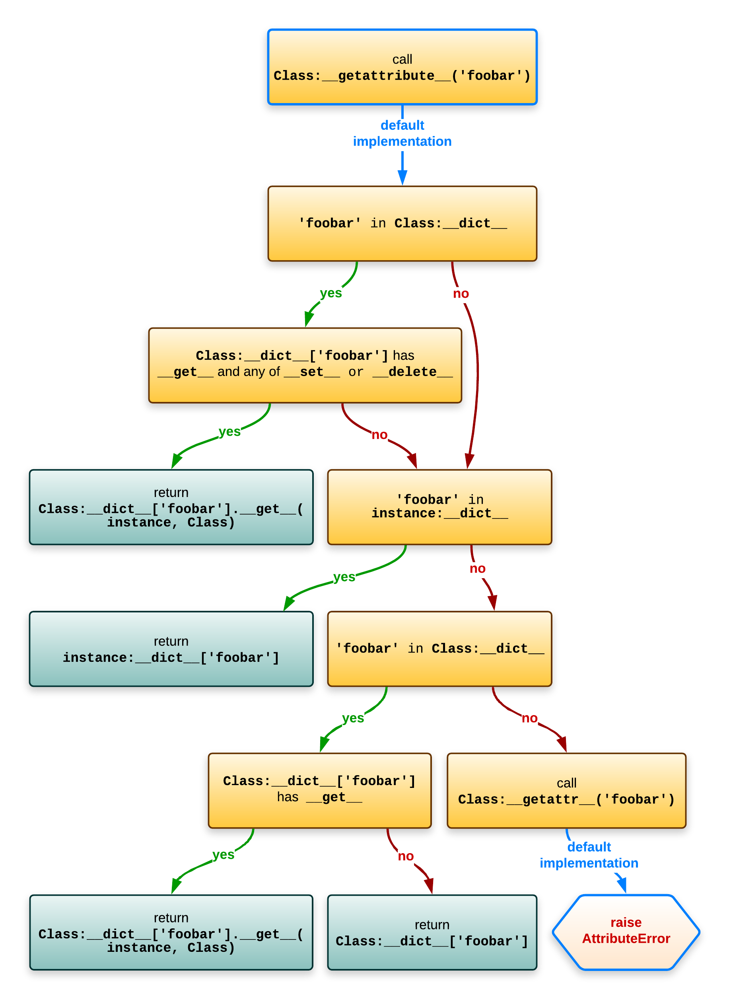

==========
Descriptor
==========

What is descriptor
------------------

Descriptor is a instance of class with certain methods. There are two kind of descriptor.

* non-data descriptor: Only ``__get__`` is defined in class.
* data descriptor: ``__get__`` and one of ``__set__`` or ``__del__`` is defined in class.

Object attribute lookup
-----------------------

``Class.__dict__`` is not a real dict but a special dict proxy that will also look in all the base classes.

For clarity I've simplified things to Class.__dict__['foobar'] but in reality the __dict__ proxy object is not used, but instead all the logic is inlined: attributes are looked up on the class of the object in the order of the __mro__ via typeobject.c:_PyType_Lookup (called from object.c: _PyObject_GenericGetAttrWithDict).

When you need descriptor
------------------------

Based on above lookup figure, if you need extra operation when you do ``obj.attr``, you could use descriptor.

How to write a descriptor
-------------------------

.. code:: python

  # lazy_properties.py
  import time

  class LazyProperty:

      def __init__(self, function):
          print("init")
          self.function = function
          self.name = function.__name__

      def __get__(self, obj, type=None) -> object:
          print("__get__")
          print(obj)
          obj.__dict__[self.name] = self.function(obj)
          return obj.__dict__[self.name]

  class DeepThought:

      @LazyProperty
      def meaning_of_life(self):
          print("func")
          time.sleep(3)
          return 42
  # Output
  # init
  

  >>> my_deep_thought_instance = DeepThought()
  >>> print(my_deep_thought_instance.meaning_of_life)
  # Output
  # __get__
  # <__main__.DeepThought object at 0x7f917bc07220>
  # func
  # 42 (print out after 3 seconds)
  
  >>> print(my_deep_thought_instance.meaning_of_life)
  # 42 (immediatelly)
  
  >>> print(my_deep_thought_instance.meaning_of_life)
  # 42 (immediatelly)

Decorator is just a syntax suger. ``LazyProperty`` get a function and return a object. It could be translated to:

.. code:: python

  ...
  class DeepThought:

      def meaning_of_life(self):
          print("func")
          time.sleep(3)
          return 42

      meaning_of_life = LazyProperty(meaning_of_life) 
      # This is run in class definition.
      # This is why "init" was print out immediately after class definition.
  ...

The things we keep in mind is a order of lookup attribute:
  1. First, you’ll get the result returned from the ``__get__`` method of the *data descriptor* named after the attribute you’re looking for.
  2. If that fails, then you’ll get the value of your object’s ``__dict__`` for the key named after the attribute you’re looking for. This is trying to get value from instance attribute, aka by ``.`` operation.
  3. If that fails, then you’ll get the result returned from the ``__get__`` method of the *non-data descriptor* named after the attribute you’re looking for.

Most tricky part is in code below:

.. code:: python

  def __get__(self, obj, type=None) -> object:
      print("get")
      print(obj)
      obj.__dict__[self.name] = self.function(obj)
      return obj.__dict__[self.name]

At the beginning, obj's ``__dict__`` doesn't have ``meaning_of_life``. However, meaning_of_life is a non-data descriptor, so ``__get__`` is invoked. After first run, inside ``__get__``, ``__dict__`` is modified and ``meaning_of_life`` is added to ``__dict__``. So next time when lookup ``meaning_of_life`` by ``.meaning_of_life``, ``__dict__`` has higher priority than non-data descriptor, it will get the result from cached ``__dict__`` directly instead of invode ``__get__`` again.

.. note::

  When you implement the protocol, keep these things in mind:
    
    * ``self`` is the instance of the descriptor you’re writing, ``meaning_of_life`` here, also it's a class attribute.
    * ``obj`` is the instance of the object your descriptor is attached to, ``my_deep_thought_instance`` here.

.. caution::

  ``__dict__`` only have instance attributes not class attributes, see :doc:`dir vs __dict__ <dirvsdict>`. 
