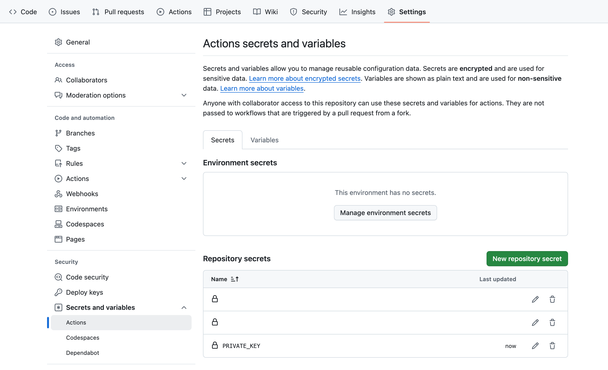
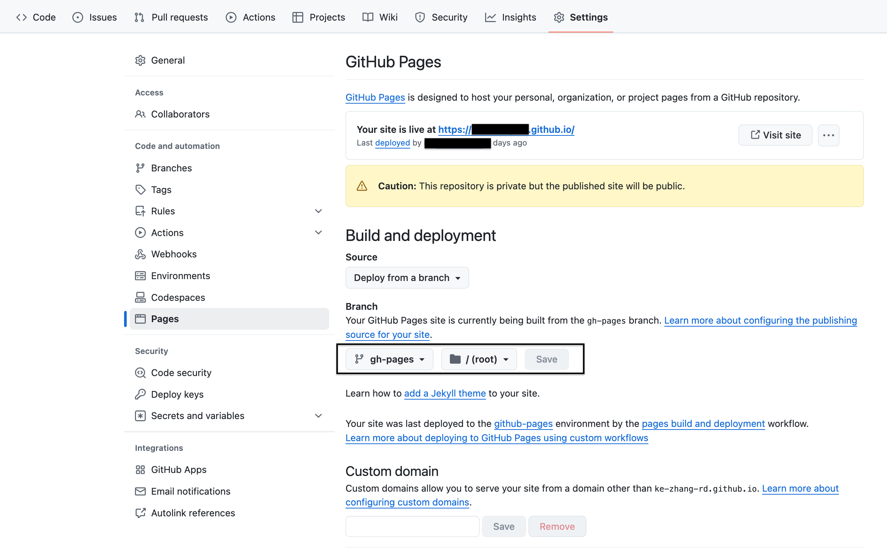

==============
Github Actions
==============

Github Action make your work after commit smoothlly. There are many github actions available under github action markets.

Example: documentation
----------------------

This involve two reporitories:

    * docs repo, which is usually in github.com/USER_NAME/repo
    * depolyment repo which is in USER_NAME.github.io/repo.

This documentation deployment and publish action could be find in  `peaceiris/action-gh-pages <https://github.com/peaceiris/actions-gh-pages>`_.

To generate keys pair, private key and public key, 
Those two keys are github email related and can be acquired by cmd below

.. code:: shell
  
  ssh-keygen -t rsa -b 4096 -C "$(git config user.email)" -f gh-pages -N ""

This command will generate two keys. One is gh-pages and the other one is gh-pages.pub.

You need add private key, gh-pages to working repo secrects under repo setting > Secrets and variables > Actions. Then press "New reporitory secret". Give it a title. 

You need add public key to github.io repo to under repo setting > Deploy keys. Then press add deploy key. Give it a title and paste the gh-pages.pub. check Allow write access.

.. code:: shell

  - name: Publish docs
      if: ${{ github.event_name == 'push' && github.ref == 'refs/heads/master' && matrix.python-version == '3.12' }}
      uses: peaceiris/actions-gh-pages@bbdfb200618d235585ad98e965f4aafc39b4c501  # v3.7.3
      with:
        deploy_key: ${{ secrets.PRIVATE_KEY}}
        publish_branch: BRANCH_NAME
        publish_dir: ./docs/build/html
        external_repository: USER_NAME/USER_NAME.github.io
        destination_dir: ${{ env.REPOSITORY_NAME }}
        keep_files: true  # Keep old files.
        force_orphan: false  # Keep git history.

You need make sure secrets.PRIVATE_KEY match the private key name in your github docs repo setting under repo setting > Secrets and variables > Actions

You need make sure the `publish_branch` name match the name of branch in the setting of documentation repo which is in `Setting`, `Pages`, `Build and deployment` > `Branch`

ssh-keygen Manual

https://man.openbsd.org/ssh-keygen.1  

How to orgnaize github actions github pages

https://github.com/peaceiris/actions-gh-pages

shell: bash -l {0}

https://stackoverflow.com/a/69070805/10642305

syntax
------

https://docs.github.com/en/actions/using-workflows/workflow-syntax-for-github-actions

How to disable actions to save minutes
--------------------------------------

https://docs.github.com/en/actions/managing-workflow-runs/disabling-and-enabling-a-workflow
